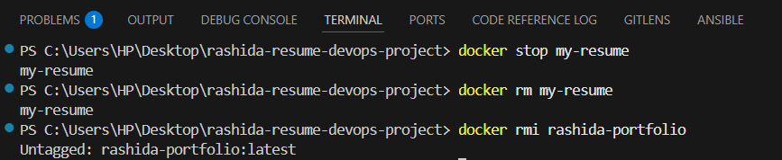

# 🌐 DevOps Portfolio – Dockerized Website

This is a personal DevOps portfolio website built using HTML, Bootstrap, and Docker. It showcases projects, skills, certifications, and includes a live resume containerized using NGINX.

---

## 🧱 Tech Stack

- HTML5 + Bootstrap 4
- Docker + NGINX
- Local Hosting (Docker Run)
- Optional: GitHub, Docker Hub, CI/CD
- Make sure Docker Desktop is running

---

## 📁 Folder Structure

portfolio/
├── index.html           # Main HTML file

├── Dockerfile           # Docker instructions

---

## 🪜 Step-by-Step Process

### 1. Create the Project Directory

- Open your terminal and create a folder directory
    mkdir <dir_name>
    cd <dir_name>
    code .
- Then start working in your VS Code Studio


---

### 2. Create `index.html`

- In the project directory create an index.html file.
- Copy and paste the index.html into it
- Make necessary changes to fit your resume
- And save


---

### 3. Create the Dockerfile

- Create a new file and name it 'dockerfile'
- Input below code
    FROM nginx:alpine
    RUN rm -rf /usr/share/nginx/html/*
    COPY . /usr/share/nginx/html
    EXPOSE 80
- And save


---

### 4. Build the Docker Image

- Open terminal and run the following command

```bash
 docker build -t <image_name> .
```


- Run the following command to check for the image

```bash
    docker images
```


---

### 5. Run the Docker Container

- Run the image in a docker container by running below command

```bash
docker run -d -p 8080:80 --name <container_name> <image_name>

```


- To check for docker containers, run the following command in your terminal

```bash
docker ps
```


- Go to browser to check for it with below link(the container was exposed to port 8080)
- Note that it would only work locally on the pc you worked on.

🌐 View it in browser: [http://localhost:8080](http://localhost:8080)


---

### 6. Push to Docker Hub (Optional)

- To push to Doker Hub. Run the following command
- The first command would tag your container for easier reference
- The second would push your container to docker hub

```bash
docker tag <tag-reference> yourdockerhubusername/<container_name>:latest
docker push yourdockerhubusername/<container_name>:latest
```


---

## 🧼 Clean Up

- To Stop And delete running conatainer run the following commands

```bash
docker stop my-portfolio
docker rm my-portfolio
docker rmi rashida-portfolio
```



---

## Summary

- Created an index.html file
- Created a dockerfile
- Created a docker image
- Run the Image in a docker container
- Pushed the image to docker hub
- And destroyed/cleaned up everything

MIT © 2025 Rashida Mohammed
